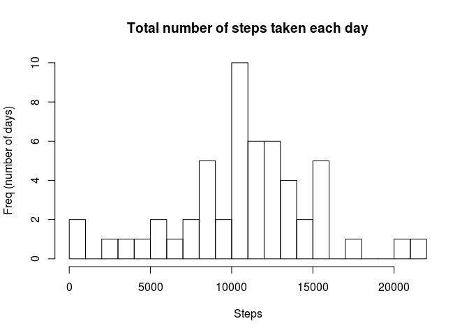
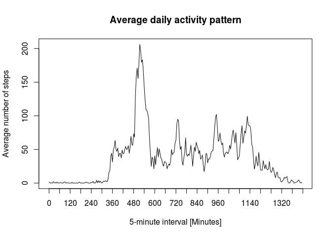
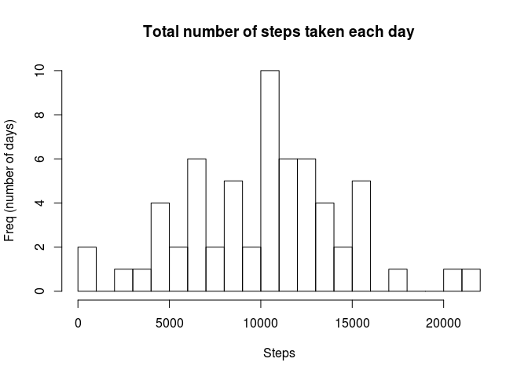
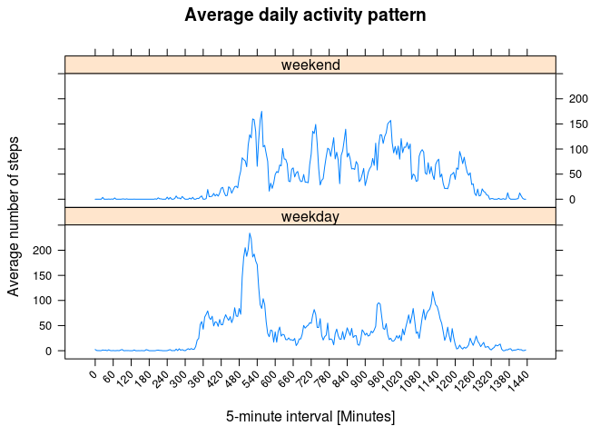

# Reproducible Research: Peer Assessment 1
DK-DataScience  
September 18, 2015  


###Loading and preprocessing the data


####1. Load the data (i.e. read.csv())

unzip & read data

```r
unzip(zipfile <- "activity.zip", exdir="./unzip")
original_data <- read.csv(file="./unzip/activity.csv")
```

####2. Process/transform the data (if necessary) into a format suitable for your analysis

transform to date format 

```r
data <- original_data
data[,2] <- as.Date(original_data[,2], "%Y-%m-%d")
```

get summary

```r
summary(data)
```

```
##      steps             date               interval     
##  Min.   :  0.00   Min.   :2012-10-01   Min.   :   0.0  
##  1st Qu.:  0.00   1st Qu.:2012-10-16   1st Qu.: 588.8  
##  Median :  0.00   Median :2012-10-31   Median :1177.5  
##  Mean   : 37.38   Mean   :2012-10-31   Mean   :1177.5  
##  3rd Qu.: 12.00   3rd Qu.:2012-11-15   3rd Qu.:1766.2  
##  Max.   :806.00   Max.   :2012-11-30   Max.   :2355.0  
##  NA's   :2304
```


###What is mean total number of steps taken per day?

####1. Calculate the total number of steps taken per day

```r
library(plyr)
dataWithoutNA <- data[complete.cases(data),]
dataByDayWithoutNA <- ddply(dataWithoutNA, "date", numcolwise(sum))
dataByDay <- ddply(data, "date", numcolwise(sum))
```

####Total number of steps taken per day:

```r
dataByDay[,1:2]
```

```
##          date steps
## 1  2012-10-01    NA
## 2  2012-10-02   126
## 3  2012-10-03 11352
## 4  2012-10-04 12116
## 5  2012-10-05 13294
## 6  2012-10-06 15420
## 7  2012-10-07 11015
## 8  2012-10-08    NA
## 9  2012-10-09 12811
## 10 2012-10-10  9900
## 11 2012-10-11 10304
## 12 2012-10-12 17382
## 13 2012-10-13 12426
## 14 2012-10-14 15098
## 15 2012-10-15 10139
## 16 2012-10-16 15084
## 17 2012-10-17 13452
## 18 2012-10-18 10056
## 19 2012-10-19 11829
## 20 2012-10-20 10395
## 21 2012-10-21  8821
## 22 2012-10-22 13460
## 23 2012-10-23  8918
## 24 2012-10-24  8355
## 25 2012-10-25  2492
## 26 2012-10-26  6778
## 27 2012-10-27 10119
## 28 2012-10-28 11458
## 29 2012-10-29  5018
## 30 2012-10-30  9819
## 31 2012-10-31 15414
## 32 2012-11-01    NA
## 33 2012-11-02 10600
## 34 2012-11-03 10571
## 35 2012-11-04    NA
## 36 2012-11-05 10439
## 37 2012-11-06  8334
## 38 2012-11-07 12883
## 39 2012-11-08  3219
## 40 2012-11-09    NA
## 41 2012-11-10    NA
## 42 2012-11-11 12608
## 43 2012-11-12 10765
## 44 2012-11-13  7336
## 45 2012-11-14    NA
## 46 2012-11-15    41
## 47 2012-11-16  5441
## 48 2012-11-17 14339
## 49 2012-11-18 15110
## 50 2012-11-19  8841
## 51 2012-11-20  4472
## 52 2012-11-21 12787
## 53 2012-11-22 20427
## 54 2012-11-23 21194
## 55 2012-11-24 14478
## 56 2012-11-25 11834
## 57 2012-11-26 11162
## 58 2012-11-27 13646
## 59 2012-11-28 10183
## 60 2012-11-29  7047
## 61 2012-11-30    NA
```

####2. If you do not understand the difference between a histogram and a barplot, research the difference between them. Make a histogram of the total number of steps taken each day

####Histogram of the total number of steps taken each day:

```r
dat <- data.frame(Steps=dataByDay$steps)
hist(dat$Steps, breaks=18, main="Total number of steps taken each day", xlab = "Steps", ylab = "Freq (number of days)")
```

 


####3. Calculate and report the mean and median of the total number of steps taken per day

####mean and median of the total number of steps taken per day

```r
StepsSummary <- summary(dataByDay[,2])
```
####Mean of the total number of steps taken per day

```r
StepsSummary[[4]]
```

```
## [1] 10770
```
####Median of the total number of steps taken per day

```r
StepsSummary[[3]]
```

```
## [1] 10760
```


###What is the average daily activity pattern?

####1. Make a time series plot (i.e. type = "l") of the 5-minute interval (x-axis) and the average number of steps taken, averaged across all days (y-axis)

```r
dataWithoutNASumByInterval <- ddply(dataWithoutNA, "interval", numcolwise(sum))
dataCountNotNAByInterval <- ddply(data, "interval", summarise, NOTNA=sum(!is.na(steps)))
dataAverageByInterval <- dataWithoutNASumByInterval
names(dataAverageByInterval) <- c("interval","average")
```
 
Since the interval variable made by unequal spacing , I preferred to create a variable with equal intervals in order to present the data in the graph.

```r
dataAverageByInterval <- cbind(dataAverageByInterval, MinutesTime = seq(from = 0, length.out = 288,  by = 5))
dataAverageByInterval[,2] <- dataWithoutNASumByInterval$steps / dataCountNotNAByInterval$NOTNA
```

Plot of 5-minute interval and the average number of steps taken across all days:

```r
plot(dataAverageByInterval$MinutesTime,
     dataAverageByInterval$average, 
     type = "l",
     xaxp  = c(0, 1440, 24),
     xlab = "5-minute interval [Minutes]",
     ylab = "Average number of steps",
     main = "Average daily activity pattern")
```

 

####2. Which 5-minute interval, on average across all the days in the dataset, contains the maximum number of steps?

```r
indexMax <- which.max(dataAverageByInterval$average)
interval <- dataAverageByInterval[indexMax,1]
```

Interval that contains the maximum number of steps on average across all the days is:

```r
interval
```

```
## [1] 835
```


###Imputing missing values

####1. Calculate and report the total number of missing values in the dataset (i.e. the total number of rows with NAs)

```r
TotalNACount <-  sum(is.na(data$steps))
```
The total number of missing (NA) value in the dataset is:

```r
TotalNACount
```

```
## [1] 2304
```

####2. Devise a strategy for filling in all of the missing values in the dataset. The strategy does not need to be sophisticated. For example, you could use the mean/median for that day, or the mean for that 5-minute interval, etc.

Introduction:
One of the main reason that value of each inverval can significantly different between days is seasonality, and spetianlly week seasonality. Based on it, filling missing value be by data from same weekday can improve the estimation. To improve the istimation all extreme values don't take part in the calculation and it's done by mean value of first, second (median) and third quartile.

Step1: Add weekday to data that clear of NA vaulues
Step2: Calculate first, second and third quartile of steps split by weekday and interval
Step3: Calculate mean of quartile values
Step4: Replace NA values of original data with suitable (by weekday, interval) calculated value 

####3. Create a new dataset that is equal to the original dataset but with the missing data filled in.

Step1

```r
weekdayWithoutNA <- weekdays(dataWithoutNA[,2])
dataWithoutNAWithWeekday <- cbind(dataWithoutNA,weekdayWithoutNA)
```

Step2

```r
quartileDataWithoutNAByWeekdayAndInterval <- ddply(dataWithoutNAWithWeekday, c("weekdayWithoutNA", "interval"), summarize,
                                                              quantile1=quantile(steps)[2], 
                                                              quantile2=quantile(steps)[3],
                                                              quantile3=quantile(steps)[4])
```

Step3

```r
meanOfQuartiles <- rowMeans(quartileDataWithoutNAByWeekdayAndInterval[,3:5])
meanquarData <- cbind(quartileDataWithoutNAByWeekdayAndInterval[,1:2],
                      meanOfQuartiles)
```

Step4

```r
weekday <- weekdays(data[,2])
dataWithWeekday <- cbind(data,weekday)
filledData <- dataWithWeekday
for(i in 1:length(dataWithWeekday$steps)) {
    if (is.na(dataWithWeekday[i,]$steps)) {
        filledData[i,]$steps = meanquarData[((meanquarData$weekday==dataWithWeekday[i,]$weekday)&(meanquarData$interval==dataWithWeekday[i,]$interval)),3]
    }
}
```

####4. Make a histogram of the total number of steps taken each day and Calculate and report the mean and median total number of steps taken per day. Do these values differ from the estimates from the first part of the assignment? What is the impact of imputing missing data on the estimates of the total daily number of steps?

Histogram of the total number of steps taken each day:

```r
filledDataByDay <- ddply(filledData, "date", numcolwise(sum))
dat <- data.frame(Steps=filledDataByDay$steps)
```


```r
hist(dat$Steps, breaks=18, main="Total number of steps taken each day", xlab = "Steps", ylab = "Freq (number of days)")
```

 

####mean and median of the total number of steps taken per day of the filled data

```r
StepsSummary <- summary(filledDataByDay[,2])
```

####Mean of the total number of steps taken per day

```r
StepsSummary[[4]]
```

```
## [1] 10080
```
####Median of the total number of steps taken per day

```r
StepsSummary[[3]]
```

```
## [1] 10400
```

Yes, we can see that these values differ. The histogram plot became more similar to graph of Gaussian function. The interval between median and the mean value become beggier.

###Are there differences in activity patterns between weekdays and weekends?

####1. Create a new factor variable in the dataset with two levels – “weekday” and “weekend” indicating whether a given date is a weekday or weekend day.


```r
day <- ifelse((dataWithoutNAWithWeekday$weekday == 'Sunday')|(dataWithoutNAWithWeekday$weekday == 'Saturday'), 'weekend', 'weekday')
dataWithoutNAWithWeekendDays <- cbind(dataWithoutNAWithWeekday[,1:3], day)
```

####2. Make a panel plot containing a time series plot (i.e. type = "l") of the 5-minute interval (x-axis) and the average number of steps taken, averaged across all weekday days or weekend days (y-axis). See the README file in the GitHub repository to see an example of what this plot should look like using simulated data.


```r
dataWithoutNAMeanByIntervalAndDay <- ddply(dataWithoutNAWithWeekendDays, c("day","interval"), numcolwise(mean))
dataWithoutNAMeanByIntervalAndDay[,2] <- seq(from = 0, length.out = 288,  by = 5)
names(dataWithoutNAMeanByIntervalAndDay) <- c("day","MinutesTime","mean")
```

####Plot of average daily activity pattern

```r
library(lattice)
xyplot(mean~MinutesTime|day,data=dataWithoutNAMeanByIntervalAndDay,
       type="l",
       scales = list(
         x = list(
           at = seq(from = 0, to = 1440,  by = 60),
           rot = 45
         )
       ),
       xlab = "5-minute interval [Minutes]",
       ylab = "Average number of steps",
       main = "Average daily activity pattern",
       layout = c(1,2))
```

 
